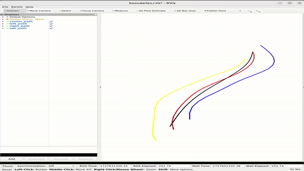

# Min Curv Planner QP

This project is a Quadratic Programming (QP) based minimum curvature path planner with a ROS wrapper. Below are the instructions to build and execute an example of how to use the library.




## Prerequisites

Ensure you have the following dependencies installed:
- CMake >= 3.18
- OSQP
- OSQP Eigen
- ROS (tested on Noetic). Follow this [link](https://wiki.ros.org/noetic/Installation/Ubuntu) to install:

### Installing OSQP

```sh
git clone https://github.com/oxfordcontrol/osqp
cd osqp
git checkout release-0.6.3
git submodule update --init --recursive
mkdir build
cd build
cmake .. -G "Unix Makefiles" -DCMAKE_BUILD_TYPE=Release
make
sudo make install
```

### Installing OSQP Eigen

```sh
git clone https://github.com/robotology/osqp-eigen
cd osqp-eigen
mkdir build
cd build
cmake .. -G "Unix Makefiles" -DCMAKE_BUILD_TYPE=Release
make
sudo make install
```

### Install CMake 3.18 on ubuntu 20.04
```sh
sudo apt update && apt install -y wget
wget https://github.com/Kitware/CMake/releases/download/v3.20.0/cmake-3.20.0.tar.gz
tar -zxvf cmake-3.20.0.tar.gz
cd cmake-3.20.0
./bootstrap
make
sudo make install
```

### Building the Project

```sh
mkdir -p min_curv_planner_ws/src
cd min_curv_planner_ws/src
git clone https://github.com/albertgassol1/min_curv_planner_qp_ros.git
git submodule update --init --recursive
cd ..
catkin init
catkin build
source devel/setup.bash
```

### Executing the ROS wrapper

The ros wrapper can be launched with:

```sh
roslaunch min_curv_ros_wrapper min_curv.launch
```

Some parameters can be set in [./min_curv_ros_wrapper/config/params.yaml](./min_curv_ros_wrapper/config/params.yaml).


### Example

After launching the ros_wrapper, you can visualize how the library works by launching a python node that published pre-defined boundaries. To do so, run:
```sh
roslaunch roslaunch boundary_publisher_example publish_boundary.launch
```
This will launch the example and an rviz session where you can visualize the results.


### Docker

A dockerfile is provided to try the wrapper without having to install everything on your system.

```sh
git clone https://github.com/albertgassol1/min_curv_planner_qp_ros.git
git submodule update --init --recursive
docker build -t min_curv_ros .
docker run -i -t --name min_curv_ros -e DISPLAY=$DISPLAY -v /tmp/.X11-unix:/tmp/.X11-unix -v ./:/workspace/min_curv_planner_ws/src/min_curv_planner_qp_ros min_curv_ros /bin/bash
```

Inside the docker container run:
```sh
cd min_curv_planner_ws
catkin init
catkin build
source devel/setup.bash
roslaunch min_curv_ros_wrapper min_curv.launch
```

Attach to the docker image in a new terminal and run the boundary publisher example by running:

```sh
docker exec -it min_curv_ros /bin/bash
cd min_curv_planner_ws
source devel/setup.bash
roslaunch boundary_publisher_example publish_boundary.launch
```

### Aknowledgment

The project utilizes the `nanoflann` library (https://github.com/jlblancoc/nanoflann?tab=License-1-ov-file#readme), which is a C++ header-only library for Nearest Neighbor (NN) search with KD-trees. This library is particularly useful for efficiently solving nearest neighbor queries, which is a common requirement in path planning algorithms.
